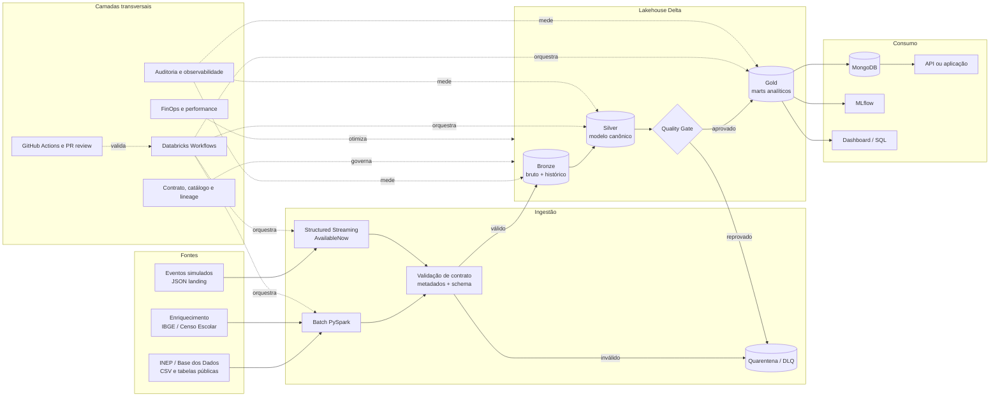

# Pipeline Híbrido de Alfabetização Infantil

Pipeline Lakehouse para integrar dados educacionais em **batch e streaming**, aplicar regras de qualidade, construir indicadores por município e disponibilizar os resultados para análise, serving NoSQL e experimentos de Machine Learning.

> Tech Challenge — Fase 2 · FIAP Pós Tech  
> Plataforma principal: Databricks Free Edition · PySpark · Delta Lake

<p align="center">
  
</p>

## O que este projeto entrega

O projeto foi estruturado para demonstrar mais do que uma carga de dados. Ele cobre o ciclo completo de um produto de dados:

- ingestão histórica em batch e simulação de eventos em streaming;
- armazenamento em arquitetura Medalhão com Delta Lake;
- contrato canônico para integrar fontes com formatos diferentes;
- quarentena para registros inválidos, sem interromper toda a carga;
- controles de idempotência, rastreabilidade e qualidade;
- marts analíticos por município, UF, rede e período;
- serving em MongoDB com estratégia de `upsert`;
- experimentos e métricas registrados no MLflow;
- observabilidade técnica e de dados;
- orquestração por Databricks Workflows;
- práticas de Git, documentação, segurança e FinOps.

## Arquitetura-alvo



### Decisões principais

| Decisão | Motivo |
|---|---|
| Batch e streaming convergem na Silver | Evita duas verdades de negócio e permite consumo uniforme. |
| Bronze preserva payload e metadados | Facilita auditoria, reprocessamento e investigação de falhas. |
| Quarentena separada | Um registro ruim não precisa derrubar todo o pipeline. |
| Quality Gate antes da Gold | Impede que indicadores inconsistentes cheguem ao consumo. |
| Chaves e `record_id` determinísticos | Reduz duplicidade e torna reexecuções idempotentes. |
| MongoDB com `upsert` | Evita apagar toda a coleção a cada execução. |
| Métricas operacionais em tabela Delta | Permite acompanhar volume, duração, frescor e falhas ao longo do tempo. |

## Fluxo de execução

| Ordem | Etapa | Entrada | Saída | Responsabilidade |
|---:|---|---|---|---|
| 00 | Setup | Configuração | schemas, volumes e tabela de auditoria | Plataforma |
| 01 | Bronze batch | CSV / fontes públicas | tabelas Bronze + metadados | Ingestão |
| 02 | Bronze streaming | eventos JSON | eventos Bronze + checkpoint | Streaming |
| 03 | Silver | Bronze batch + streaming | modelo canônico e dimensões integradas | Analytics |
| 06 | Quality Gate | Silver | validações, métricas e quarentena | Analytics + Streaming |
| 04 | Gold | Silver aprovada | marts por município, meta e evolução | Analytics |
| 05 | Serving | Gold | documentos no MongoDB | Analytics |
| 07 | MLflow | Gold enriquecida | modelo, parâmetros e métricas | Analytics / IA |
| 08 | Monitoramento | logs e tabelas Delta | painel operacional e evidências | Plataforma + Streaming |

> A qualidade é executada antes da Gold. Essa ordem evita publicar indicadores incorretos e corrige uma fragilidade comum em pipelines acadêmicos.

## Camadas de dados

### Bronze

A Bronze preserva os dados recebidos e acrescenta somente metadados técnicos:

- `_ingestion_timestamp`;
- `_source_file` ou `_event_id`;
- `_source_system`;
- `_pipeline_run_id`;
- `_schema_version`.

Não são aplicadas regras de negócio nessa camada.

### Silver

A Silver representa o modelo canônico do projeto. Nela são realizadas:

- tipagem explícita;
- normalização de `sigla_uf`, `id_municipio` e `rede`;
- deduplicação por chave de negócio;
- união entre medições batch e streaming;
- integração com município, UF e metas;
- criação de `alfabetizado`, conforme regra documentada no `CONTRACT.md`;
- segregação de registros inválidos.

### Gold

A Gold contém tabelas prontas para consumo:

| Tabela | Grão | Uso |
|---|---|---|
| `gold.indicador_municipio` | ano + município + rede | análise territorial e ranking |
| `gold.meta_vs_resultado` | ano + município | comparação da taxa observada com a meta |
| `gold.evolucao_temporal` | município + rede | evolução histórica e tendência |
| `gold.resumo_uf` | ano + UF + rede | visão executiva e dashboard |

## Contrato do evento de streaming

Exemplo de payload:

```json
{
  "event_id": "6cfbf7e6-9940-4c52-aeb9-1fb670e4fd5c",
  "event_time": "2026-06-30T15:00:00Z",
  "schema_version": "1.0",
  "ano": 2025,
  "sigla_uf": "SP",
  "id_municipio": "3550308",
  "rede": 3,
  "taxa_alfabetizacao": 0.8125,
  "source": "simulador_medicoes"
}
```

Campos obrigatórios e regras de domínio estão definidos em [`CONTRACT.md`](CONTRACT.md).

## Qualidade de dados

As verificações mínimas são:

- unicidade de `record_id`;
- `id_municipio` com sete dígitos;
- `sigla_uf` com duas letras e pertencente ao domínio brasileiro;
- `rede` dentro dos valores aceitos;
- taxas entre `0` e `1` ou percentuais entre `0` e `100`, conforme a fonte;
- integridade referencial com as dimensões;
- completude dos campos críticos;
- detecção de queda ou aumento anormal de volume;
- frescor da última carga;
- ausência de regressão na quantidade de municípios cobertos.

Registros reprovados devem ser gravados em `workspace.observability.quarantine_records`, acompanhados do motivo da rejeição.

## Observabilidade

O pipeline deve registrar, por etapa:

| Métrica | Exemplo de uso |
|---|---|
| `run_id` e status | rastrear uma execução ponta a ponta |
| linhas lidas, aprovadas e rejeitadas | avaliar perda de dados |
| duração | identificar gargalos |
| horário do dado mais recente | medir frescor |
| duplicatas encontradas | detectar falhas de idempotência |
| atraso do streaming | comparar `event_time` e ingestão |
| versão do schema | controlar evolução do contrato |

Alertas recomendados:

- falha de task;
- Silver sem dados após carga Bronze;
- rejeição acima de 5%;
- queda de volume superior a 30% contra a média recente;
- atraso de evento acima do SLA definido;
- ausência de atualização na Gold.

## Aplicação de Machine Learning

O MLflow deve ser usado para comparar um baseline simples com pelo menos uma abordagem adicional. Exemplos:

1. **Regressão:** estimar a taxa de alfabetização com variáveis territoriais e educacionais.
2. **Clustering:** agrupar municípios por perfil de vulnerabilidade.
3. **Detecção de anomalias:** identificar variações incompatíveis com o histórico.

Cada experimento deve registrar:

- versão dos dados;
- features utilizadas;
- parâmetros;
- métricas;
- artefatos;
- limitações e riscos de interpretação.

Não deve ser publicada no README uma métrica fixa antes que o notebook gere e registre o resultado reproduzível.

## O que cada integrante pode entregar além do mínimo

| Frente | Entrega principal | Diferenciais que aumentam a qualidade do projeto |
|---|---|---|
| **P1 — Plataforma e DevOps** | workspace, volumes, Workflow e Git | CI para validar JSON/Markdown/Python, secrets, auditoria, runbook, branch protection e release tag |
| **P2 — Fontes e Bronze** | ingestão das fontes e dicionário | profiling automático, metadados de origem, controle de versão, reconciliação de contagem e enriquecimento IBGE |
| **P3 — Streaming e Observabilidade** | producer, consumer e métricas | `event_id`, deduplicação, checkpoint isolado, atraso, quarentena, replay e alertas por SLA |
| **P4 — Analytics, Serving e IA** | Silver, Gold, MongoDB e MLflow | modelo canônico, testes de regra, `upsert`, dashboard, baseline, explicabilidade e model card |
| **Todos** | integração e apresentação | revisão cruzada, teste ponta a ponta, roteiro de demo, decisões registradas e retrospectiva técnica |

A divisão detalhada está em [`TASKS.md`](TASKS.md) e o modo de trabalho do time em [`docs/team_playbook.md`](docs/team_playbook.md).

## Estrutura do repositório

```text
.
├── .github/workflows/        # validações automáticas do repositório
├── data/sample/              # amostras sem dados sensíveis
├── docs/
│   ├── architecture.svg
│   ├── data_dictionary.md
│   ├── flow_review.md
│   ├── runbook.md
│   └── team_playbook.md
├── notebooks/
│   ├── 00_setup_ambiente.py
│   ├── 01_bronze_batch.py
│   ├── 02_bronze_streaming.py
│   ├── 03_silver.py
│   ├── 04_gold.py
│   ├── 05_serving_mongodb.py
│   ├── 06_quality_checks.py
│   ├── 07_ml_mlflow.py
│   └── 08_monitoring.py
├── src/                      # schemas, regras e utilitários compartilhados
├── tests/                    # testes executáveis fora do notebook
├── workflows/                # definição do Databricks Workflow
├── CONTRACT.md               # contrato técnico e regras de negócio
├── TASKS.md                  # backlog e responsáveis
└── requirements.txt
```

## Como executar

### Pré-requisitos

- conta no Databricks Free Edition;
- acesso ao catálogo `workspace`;
- arquivos de entrada disponíveis em um Volume do Unity Catalog;
- MongoDB Atlas apenas para a etapa de serving;
- segredo `mongo_uri` configurado no Databricks para uso real.

### Passos

1. Faça um fork ou clone do repositório.
2. Importe o projeto pelo Databricks Repos.
3. Execute `00_setup_ambiente.py`.
4. Envie os arquivos para `/Volumes/workspace/bronze/raw_files/`.
5. Rode o Workflow ou execute os notebooks na ordem indicada na seção “Fluxo de execução”.
6. Consulte `workspace.observability.pipeline_metrics` para validar o resultado.
7. Execute o roteiro de demonstração descrito em [`docs/runbook.md`](docs/runbook.md).

## Workflow e Git

Fluxo recomendado:

```text
feature/<tema> → pull request → develop → validação integrada → main → tag de entrega
```

Regras mínimas:

- nenhuma alteração direta em `main`;
- PR com descrição, evidência de teste e impacto no contrato;
- ao menos uma revisão de outro integrante;
- mudança de schema exige atualização do `CONTRACT.md` e do dicionário;
- credenciais nunca são versionadas;
- o pipeline completo deve ser testado antes da tag de entrega.

## FinOps e performance

Para o volume acadêmico, otimização excessiva pode custar mais do que economiza. As decisões devem considerar tamanho real e padrão de consulta.

Práticas adotadas ou recomendadas:

- cluster de Job com desligamento automático;
- uso de Spot apenas em etapas reprocessáveis;
- evitar particionamento de tabelas muito pequenas;
- `OPTIMIZE` e `ZORDER` somente quando o histórico justificar;
- `VACUUM` respeitando a política de retenção;
- evitar `toPandas()` para coleções grandes;
- registrar duração e volume para estimar custo por execução;
- separar ambientes de desenvolvimento e entrega quando disponível.

> Valores de custo devem ser apresentados como estimativa de cenário e nunca como preço garantido.

## Demonstração sugerida

Uma apresentação forte pode seguir este roteiro:

1. executar uma carga batch;
2. publicar dois eventos de streaming, incluindo um duplicado;
3. publicar um evento inválido e mostrar a quarentena;
4. executar a Silver e o Quality Gate;
5. consultar o indicador por município na Gold;
6. mostrar a atualização no MongoDB por `upsert`;
7. abrir a execução no MLflow;
8. mostrar as métricas e o `run_id` no monitoramento.

Esse roteiro demonstra ingestão, resiliência, qualidade, consumo e governança em poucos minutos.

## Limitações conhecidas

- o streaming é uma simulação por arquivos e `AvailableNow`, não um Kafka ativo;
- a qualidade das análises depende da cobertura das fontes e do correto de-para de `rede`;
- a regra de corte deve permanecer documentada e validada com a fonte oficial usada no trabalho;
- o modelo de IA é exploratório e não deve ser interpretado como ferramenta de decisão sobre estudantes;
- o Databricks Free Edition possui limitações de infraestrutura e integração.

## Roadmap

- [ ] completar todas as fontes e o dicionário de dados;
- [ ] implementar replay de eventos da quarentena;
- [ ] adicionar testes de integração com amostras locais;
- [ ] criar dashboard executivo;
- [ ] implementar comparação de experimentos no MLflow;
- [ ] publicar uma release reproduzível com evidências da execução;
- [ ] avaliar uma API de consulta sobre a camada de serving.

## Documentação complementar

- [Contrato técnico e de negócio](CONTRACT.md)
- [Backlog e responsáveis](TASKS.md)
- [Revisão do fluxo](docs/flow_review.md)
- [Playbook do time](docs/team_playbook.md)
- [Runbook de execução e demonstração](docs/runbook.md)
- [Dicionário de dados](docs/data_dictionary.md)
