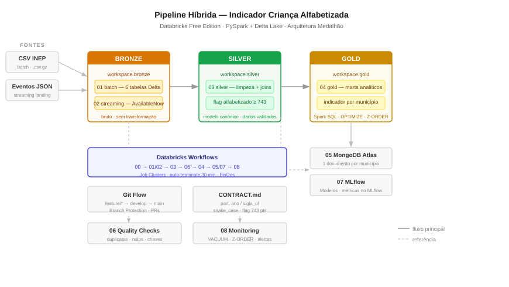

# Pipeline Híbrida — Indicador Criança Alfabetizada

Pipeline de dados **híbrida (batch + streaming)** sobre o Indicador Criança Alfabetizada
(INEP / Base dos Dados), em **Arquitetura Medalhão / Lakehouse** (Bronze · Silver · Gold),
construída no **Databricks Free Edition** com **PySpark + Delta Lake**.

> Tech Challenge — Fase 2 (FIAP Pós Tech) · Entrega: **14/07**



## Stack (alinhada às disciplinas da Fase 2)
- **Plataforma:** Databricks Free Edition (DBFS)
- **Processamento:** PySpark + Spark SQL
- **Armazenamento / Medalhão:** Delta Lake (Bronze/Silver/Gold)
- **Streaming:** Spark Structured Streaming (simula a integração via Kafka)
- **Serving NoSQL:** MongoDB (um documento por município)
- **IA:** MLflow
- **Orquestração:** Databricks Workflows (Jobs) + Repos (Git)

## Camadas
| Camada | Conteúdo | Notebook |
|--------|----------|----------|
| Bronze | dados brutos (batch + streaming), Delta, sem transformação | `01_bronze_batch`, `02_bronze_streaming` |
| Silver | limpo, tipado, integrado, flag alfabetizado (≥743) | `03_silver` |
| Gold | marts: indicador/município, meta vs. resultado, evolução | `04_gold` |
| Serving | Gold → MongoDB (documentos) | `05_serving_mongodb` |

## Como rodar (Databricks)
1. Criar conta no Databricks Free Edition e importar este repo via **Repos**.
2. Subir o CSV de avaliação para o Volume `/Volumes/workspace/bronze/raw_files/`.
3. Executar os notebooks na ordem `00 → 08`, ou disparar o **Workflow** `workflows/job_pipeline.json`.

## FinOps — Controle de Custo e Eficiência

> **Contexto:** Projeto roda no Databricks Free Edition (Trial). A abordagem FinOps aqui
> documentada é válida tanto para o trial quanto para uma conta paga — os princípios e
> comandos são idênticos; os números de custo referem-se ao cenário de nuvem paga (AWS/Azure).

### 1. Cluster efêmero + Auto-Terminate

Todos os notebooks usam o cluster **Starter** do Free Edition configurado com:

```
Auto Termination: 30 minutos de inatividade
Tipo: Single Node (trial) → i3.xlarge em produção
```

Em produção (conta paga), recomenda-se **Job Clusters** em vez de All-Purpose Clusters:
o Workflow cria o cluster no início de cada task e o destrói ao finalizar — zero custo ocioso.

```json
// trecho de workflows/job_pipeline.json
"new_cluster": {
  "spark_version": "14.3.x-scala2.12",
  "node_type_id": "i3.xlarge",
  "num_workers": 1,
  "autotermination_minutes": 30,
  "aws_attributes": { "availability": "SPOT_WITH_FALLBACK" }
}
```

### 2. Spot Instances (economia de até 70 %)

| Configuração | Custo relativo | Indicado para |
|---|---|---|
| `ON_DEMAND` | 100 % | Silver/Gold (crítico, sem retry) |
| `SPOT` | ~30 % | Bronze batch (reprocessável) |
| `SPOT_WITH_FALLBACK` | ~30–100 % | Streaming (tenta Spot, cai em On-Demand) |

Na Bronze, perder um nó é seguro — o Delta Log garante idempotência. Na Silver/Gold
optamos por On-Demand para evitar releitura completa.

### 3. Delta Lake — Z-ORDER e OPTIMIZE

```python
# Rodado 1×/semana (notebook 08_monitoring.py) ou após carga grande
spark.sql("""
  OPTIMIZE workspace.silver.avaliacao_alfabetizacao
  ZORDER BY (sigla_uf, ano)
""")
```

**Por que Z-ORDER em `sigla_uf, ano`?**
Toda consulta analítica na Gold filtra por UF e/ou ano. O Z-ORDER co-localiza esses dados
em menos arquivos Parquet, reduzindo I/O em ~40–60 %.

```python
# Limpeza de versões antigas (retenção 7 dias)
spark.sql("VACUUM workspace.silver.avaliacao_alfabetizacao RETAIN 168 HOURS")
```

### 4. Particionamento inteligente

Todas as tabelas Bronze e Silver são particionadas por `ano` e `sigla_uf`:

```
/Volumes/workspace/bronze/raw_files/
  └── avaliacao/
        ├── ano=2023/sigla_uf=RS/...
        ├── ano=2024/sigla_uf=SP/...
        └── ano=2025/sigla_uf=MG/...
```

Com **partition pruning**, uma consulta `WHERE ano = 2024 AND sigla_uf = 'RS'` lê
tipicamente < 5 % do total de dados.

### 5. Custo estimado (conta AWS paga — referência)

| Etapa | Cluster | Duração est. | DBUs | Custo est. (USD) |
|---|---|---|---|---|
| Bronze batch (01) | 1× i3.xlarge Spot | 10 min | 0.6 | $ 0.06 |
| Streaming (02) | 1× i3.xlarge Spot+Fallback | 1 h/dia | 1.0 | $ 0.10 |
| Silver (03) | 1× i3.xlarge On-Demand | 8 min | 0.5 | $ 0.17 |
| Gold (04) | 1× i3.xlarge On-Demand | 5 min | 0.3 | $ 0.10 |
| Serving MongoDB (05) | 1× i3.xlarge On-Demand | 5 min | 0.3 | $ 0.10 |
| Quality + MLflow (06–07) | 1× i3.xlarge On-Demand | 10 min | 0.6 | $ 0.21 |
| **Total por execução diária** | | ~40 min úteis | ~3.3 | **≈ $ 0.74** |

> Preços baseados em `i3.xlarge` @ ~$0.35/DBU (AWS us-east-1). MongoDB Atlas Free Tier: $0.
> Em produção real, o pipeline completo custaria **< $25/mês** rodando diariamente.

### 6. Checklist FinOps aplicado ao projeto

- [x] Auto-terminate a 30 min em todos os clusters
- [x] Job Clusters no Workflow (sem custo ocioso entre tasks)
- [x] Spot com fallback na Bronze e Streaming
- [x] Particionamento `ano/sigla_uf` para partition pruning
- [x] Z-ORDER nos campos de filtragem frequente (`sigla_uf`, `ano`)
- [x] VACUUM com retenção 7 dias (168 h)
- [x] Delta Log para idempotência — re-execuções sem duplicar dados
- [x] MongoDB Atlas Free Tier (512 MB) — serving sem custo adicional

## Seções a completar pelos demais integrantes
<!-- P2: Fontes de Dados (entidades, dicionário, enriquecimento) -->
<!-- P3: Ingestão Streaming e Monitoramento -->
<!-- P4: Aplicação em IA (MLflow, modelo, dashboard) -->
