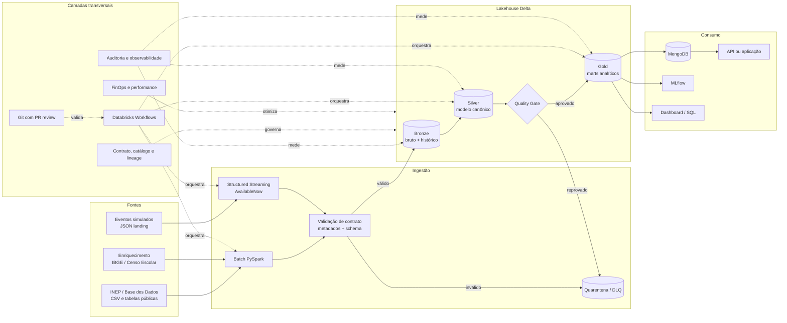

# Pipeline Híbrido de Alfabetização Infantil

Pipeline Lakehouse para integrar dados educacionais em **batch e streaming**, aplicar regras de qualidade, construir indicadores por município e disponibilizar os resultados para análise, serving NoSQL e experimentos de Machine Learning.

> Tech Challenge — Fase 2 · FIAP Pós Tech  
> Plataforma principal: Databricks Free Edition · PySpark · Delta Lake

<p align="center">
  
</p>

## Contexto do problema

A alfabetização até o final do 2º ano do ensino fundamental é um dos pilares do
desenvolvimento educacional e social do país. O **Compromisso Nacional Criança
Alfabetizada** mobiliza União, estados e municípios com a meta de que, até 2030,
todas as crianças brasileiras estejam alfabetizadas nessa etapa.

Para dar régua a essa política, a Pesquisa Alfabetiza Brasil (INEP, 2023)
definiu o **ponto de corte de 743 pontos** na escala de proficiência do Saeb:
a partir dele, a criança é considerada alfabetizada. Nasce daí o **Indicador
Criança Alfabetizada** — o percentual de estudantes que atingem esse patamar.

O problema que este pipeline resolve: os dados que explicam a alfabetização
estão espalhados em fontes heterogêneas (metas nacionais, estaduais e
municipais, dados territoriais, microdados de alunos, indicadores de
desempenho). Sem integração, não há como comparar resultado com meta, medir
desigualdade regional ou alimentar modelos preditivos. Este projeto constrói a
fundação de dados que torna essas análises possíveis, usando como fonte
principal o Indicador Criança Alfabetizada publicado na plataforma
[Base dos Dados](https://basedosdados.org).

## O que este projeto entrega

O projeto foi estruturado para demonstrar mais do que uma carga de dados. Ele cobre o ciclo completo de um produto de dados:

- ingestão histórica em batch e simulação de eventos em streaming;
- armazenamento em arquitetura Medalhão com Delta Lake;
- contrato canônico para integrar fontes com formatos diferentes;
- quarentena para registros inválidos, sem interromper toda a carga;
- controles de idempotência, rastreabilidade e qualidade;
- marts analíticos por município, UF, rede e período;
- serving em MongoDB com estratégia de `upsert`;
- experimentos e métricas registrados no MLflow;
- observabilidade técnica e de dados;
- orquestração por Databricks Workflows;
- práticas de Git, documentação, segurança e FinOps.

## Arquitetura-alvo


```mermaid
flowchart LR
    subgraph S[Fontes]
        B[INEP / Base dos Dados\nCSV e tabelas públicas]
        E[Eventos simulados\nJSON landing]
        X[Enriquecimento\nIBGE / Censo Escolar]
    end

    subgraph I[Ingestão]
        IB[Batch PySpark]
        IS[Structured Streaming\nAvailableNow]
        C[Validação de contrato\nmetadados + schema]
        Q[(Quarentena / DLQ)]
    end

    subgraph L[Lakehouse Delta]
        BR[(Bronze\nbruto + histórico)]
        SI[(Silver\nmodelo canônico)]
        DQ{Quality Gate}
        GO[(Gold\nmarts analíticos)]
    end

    subgraph O[Consumo]
        MO[(MongoDB)]
        ML[MLflow]
        BI[Dashboard / SQL]
        API[API ou aplicação]
    end

    subgraph T[Camadas transversais]
        WF[Databricks Workflows]
        OB[Auditoria e observabilidade]
        GOV[Contrato, catálogo e lineage]
        FIN[FinOps e performance]
        CICD[Git com PR review]
    end

    B --> IB --> C
    X --> IB
    E --> IS --> C
    C -->|válido| BR
    C -->|inválido| Q
    BR --> SI --> DQ
    DQ -->|aprovado| GO
    DQ -->|reprovado| Q
    GO --> MO
    GO --> ML
    GO --> BI
    MO --> API
    WF -. orquestra .-> IB
    WF -. orquestra .-> IS
    WF -. orquestra .-> SI
    WF -. orquestra .-> GO
    OB -. mede .-> BR
    OB -. mede .-> SI
    OB -. mede .-> GO
    GOV -. governa .-> L
    FIN -. otimiza .-> L
    CICD -. valida .-> WF
```

### Decisões principais

| Decisão | Motivo |
|---|---|
| Batch e streaming convergem na Silver | Evita duas verdades de negócio e permite consumo uniforme. |
| Bronze preserva payload e metadados | Facilita auditoria, reprocessamento e investigação de falhas. |
| Quarentena separada | Um registro ruim não precisa derrubar todo o pipeline. |
| Quality Gate antes da Gold | Impede que indicadores inconsistentes cheguem ao consumo. |
| Chaves e `record_id` determinísticos | Reduz duplicidade e torna reexecuções idempotentes. |
| MongoDB com `upsert` | Evita apagar toda a coleção a cada execução. |
| Métricas operacionais em tabela Delta | Permite acompanhar volume, duração, frescor e falhas ao longo do tempo. |

## Tecnologias utilizadas e justificativa

| Ferramenta | Papel | Por que foi escolhida |
|---|---|---|
| Databricks Free Edition (serverless, AWS) | Plataforma de processamento e catálogo | Cumpre o requisito de cloud sem custo; serverless elimina gestão de cluster e cobra por uso (FinOps). |
| PySpark | Motor de transformação batch e streaming | Mesmo código escala do volume acadêmico aos microdados completos; Structured Streaming dá semântica exactly-once. |
| Delta Lake | Formato de armazenamento das 3 camadas | ACID, MERGE (idempotência), time travel (histórico da Bronze) e schema enforcement em cima de Parquet. |
| Unity Catalog | Governança | Catálogo, permissões e Volumes para landing de arquivos. |
| Databricks Workflows | Orquestração | DAG nativo com dependências, propagação de `run_id` e notificação de falha, sem infra extra. |
| MongoDB Atlas (M0) | Serving NoSQL | Camada de consumo para aplicações com upsert por chave; free tier atende a demo. |
| MLflow | Experimentos de ML | Nativo no Databricks; registra parâmetros, métricas e artefatos de forma reproduzível. |
| GitHub | Versionamento e colaboração | PRs e branches conforme o fluxo descrito na seção Workflow e Git. |

## Decisões arquiteturais (trade-offs)

**Batch vs streaming** — o histórico anual do INEP não justifica streaming; já as
atualizações de medições precisam de semântica de evento (idempotência, atraso,
quarentena). Adotamos o híbrido com convergência na Silver: uma única verdade de
negócio. O custo é manter dois caminhos de ingestão, mitigado pelo contrato comum
e pelo trigger `AvailableNow`, que dá exactly-once sem cluster 24/7.

**Data lake vs data warehouse** — o lakehouse (Delta) evita duplicar armazenamento:
os mesmos arquivos servem exploração, SQL e ML. Um warehouse dedicado daria melhor
concorrência de BI, mas custaria mais e engessaria o acesso do MLflow aos dados.
No volume deste projeto, Delta + SQL serverless cobre os dois papéis.

**Custo vs performance** — escolhas deliberadas para o volume real (145 a ~39 mil
linhas): sem particionamento, sem `OPTIMIZE`/`ZORDER` prematuros, `toPandas`
restrito a coleções minúsculas. As decisões estão documentadas para reavaliação
quando o volume crescer.

## Fluxo de execução

| Ordem | Etapa | Entrada | Saída | Responsabilidade |
|---:|---|---|---|---|
| 00 | Setup | Configuração | schemas, volumes e tabela de auditoria | Plataforma |
| 01 | Bronze batch | CSV / fontes públicas | tabelas Bronze + metadados | Ingestão |
| 02 | Bronze streaming | eventos JSON | eventos Bronze + checkpoint | Streaming |
| 03 | Silver | Bronze batch + streaming + dimensões + metas + alunos | modelo canônico integrado | Analytics |
| 06 | Quality Gate | Silver | validações, métricas e quarentena | Analytics + Streaming |
| 04 | Gold | Silver aprovada | marts por município, meta e evolução | Analytics |
| 05 | Serving | Gold | documentos no MongoDB | Analytics |
| 07 | MLflow | Gold enriquecida | modelo, parâmetros e métricas | Analytics / IA |
| 08 | Monitoramento | logs e tabelas Delta | painel operacional e evidências | Plataforma + Streaming |
| 09 | Dashboard (sob demanda) | Gold | visão executiva e análise de desigualdade | Analytics |

> A qualidade é executada antes da Gold. Essa ordem evita publicar indicadores incorretos e corrige uma fragilidade comum em pipelines acadêmicos.

## Camadas de dados

### Bronze

A Bronze preserva os dados recebidos e acrescenta somente metadados técnicos:

- `_ingestion_timestamp`;
- `_source_file` ou `_event_id`;
- `_source_system`;
- `_pipeline_run_id`;
- `_schema_version`.

Não são aplicadas regras de negócio nessa camada. A reexecução usa `overwrite`
para não duplicar a fonte; o histórico de versões fica preservado pelo Delta
(time travel / `DESCRIBE HISTORY`).

### Silver

A Silver representa o modelo canônico do projeto — é nela que ocorre a
**integração das seis fontes do edital** (notebook `03_silver.py`):

- tipagem explícita e normalização de `sigla_uf`, `id_municipio` e `rede`;
- união entre medições batch (INEP, grão UF) e streaming (grão município);
- **join com `bronze.municipio` e `bronze.uf`** (nome, região, capital e flag
  `uf_consistente` — a UF do registro deve bater com a do município);
- **join com as metas** (`meta_brasil`, `meta_uf`, `meta_municipio`): cada
  medição sai com a meta do seu grão em `meta_taxa`;
- **join com o agregado de alunos** por ano+UF+rede (proficiência média e % de
  alunos acima do corte 743);
- coluna `fonte_dados` (`oficial_inep` | `simulado`) para o consumidor
  distinguir dado real de evento do simulador;
- criação de `alfabetizado`, conforme regra documentada no `CONTRACT.md`;
- deduplicação por chave de negócio (`record_id` determinístico).

### Gold

A Gold contém tabelas prontas para consumo:

| Tabela | Grão | Uso |
|---|---|---|
| `gold.indicador_municipio` | ano + município + rede | análise territorial e ranking |
| `gold.meta_vs_resultado` | ano + território (UF e município) + rede | comparação da taxa observada com a meta |
| `gold.evolucao_temporal` | ano + território + rede | evolução histórica e tendência |
| `gold.resumo_uf` | ano + UF + rede | visão executiva e dashboard (dado oficial INEP) |

Todos os marts carregam `fonte_dados`, que separa o dado oficial do INEP dos
eventos do simulador. **Importante:** a fonte batch oficial tem grão UF; o grão
municipal é alimentado pelo streaming simulado e, quando o CSV municipal
oficial da Base dos Dados for carregado (ver notebook `01`, seção 3), também
por dado real — sem mudança de código.

## Contrato do evento de streaming

Exemplo de payload:

```json
{
  "event_id": "6cfbf7e6-9940-4c52-aeb9-1fb670e4fd5c",
  "event_time": "2026-06-30T15:00:00Z",
  "schema_version": "1.0",
  "ano": 2025,
  "sigla_uf": "SP",
  "id_municipio": "3550308",
  "rede": 3,
  "taxa_alfabetizacao": 0.8125,
  "source": "simulador_medicoes"
}
```

Campos obrigatórios e regras de domínio estão definidos em [`CONTRACT.md`](CONTRACT.md).

## Qualidade de dados

As verificações mínimas são:

- unicidade de `record_id`;
- `id_municipio` com sete dígitos;
- `sigla_uf` com duas letras e pertencente ao domínio brasileiro;
- `rede` dentro dos valores aceitos;
- taxas entre `0` e `1` ou percentuais entre `0` e `100`, conforme a fonte;
- integridade referencial com as dimensões (`id_municipio` deve existir em
  `bronze.municipio`, `sigla_uf` em `bronze.uf`) e consistência entre tabelas
  (UF do registro × UF do município) — implementadas no notebook `06`;
- completude dos campos críticos;
- detecção de queda ou aumento anormal de volume;
- frescor da última carga;
- ausência de regressão na quantidade de municípios cobertos.

Registros reprovados são gravados em `workspace.observability.quarantine_records`, acompanhados do motivo da rejeição.

## Observabilidade

O Workflow injeta `{{job.run_id}}` como parâmetro em todas as tasks
(`workflows/job_pipeline.json`), então uma execução é correlacionável ponta a
ponta em `observability.pipeline_metrics`. Métricas registradas:

| Métrica | Exemplo de uso |
|---|---|
| `run_id` e status | rastrear uma execução ponta a ponta |
| linhas lidas, aprovadas e rejeitadas | avaliar perda de dados |
| duração | identificar gargalos |
| horário do dado mais recente | medir frescor |
| duplicatas encontradas | detectar falhas de idempotência |
| atraso do streaming | comparar `event_time` e ingestão |
| versão do schema | controlar evolução do contrato |

Alertas configurados e recomendados:

- falha de task (notificação por e-mail no Workflow);
- Silver sem dados após carga Bronze;
- rejeição acima de 5%;
- queda de volume superior a 30% contra a média recente;
- atraso de evento acima do SLA definido;
- ausência de atualização na Gold.

## Aplicação em IA

A camada Gold foi desenhada para servir três frentes de inteligência artificial
e análise, alinhadas ao uso em políticas públicas:

1. **Predição de alfabetização** — regressão sobre `gold.meta_vs_resultado` e
   `gold.evolucao_temporal` para estimar a taxa futura por território e
   antecipar quais municípios/UFs não atingirão a meta de 2030, permitindo
   intervenção antes da avaliação oficial. O notebook `07_ml_mlflow.py`
   implementa baseline + Random Forest com registro no MLflow.
2. **Análise de desigualdade educacional** — as dimensões integradas (região,
   UF, rede de ensino, capital/interior) permitem decompor o indicador e
   medir gaps entre redes pública e privada, entre regiões e entre capitais e
   interior — insumo direto para priorizar repasses e formação docente.
3. **Políticas públicas baseadas em evidência** — `gap_meta` e `atingiu_meta`
   por território transformam a meta do Compromisso Nacional em um painel de
   acompanhamento: onde o gap cresce, a política não está chegando. Com o
   enriquecimento socioeconômico opcional (IBGE/Censo Escolar), viabiliza
   clusters de vulnerabilidade educacional.

Cada experimento registra: versão dos dados, features, parâmetros, métricas,
artefatos e limitações (model card no notebook `07`).

## O que cada integrante pode entregar além do mínimo

| Frente | Entrega principal | Diferenciais que aumentam a qualidade do projeto |
|---|---|---|
| **P1 — Plataforma e DevOps** | workspace, volumes, Workflow e Git | secrets, auditoria, runbook, branch protection e release tag |
| **P2 — Fontes e Bronze** | ingestão das fontes e dicionário | profiling automático, metadados de origem, controle de versão, reconciliação de contagem e enriquecimento IBGE |
| **P3 — Streaming e Observabilidade** | producer, consumer e métricas | `event_id`, deduplicação, checkpoint isolado, atraso, quarentena, replay e alertas por SLA |
| **P4 — Analytics, Serving e IA** | Silver, Gold, MongoDB e MLflow | modelo canônico, testes de regra, `upsert`, dashboard, baseline, explicabilidade e model card |
| **Todos** | integração e apresentação | revisão cruzada, teste ponta a ponta, roteiro de demo, decisões registradas e retrospectiva técnica |

A divisão detalhada está em [`TASKS.md`](TASKS.md) e o modo de trabalho do time em [`docs/team_playbook.md`](docs/team_playbook.md).

## Estrutura do repositório

```text
.
├── data/
│   ├── external/             # dimensões IBGE (estados, municípios)
│   ├── raw/                  # fontes de entrada (ver data/raw/README.md)
│   └── sample/               # amostras sem dados sensíveis
├── docs/
│   ├── architecture.png/svg
│   ├── data_dictionary.md
│   ├── evidencias/            # 32 prints da execução no Databricks
│   ├── flow_review.md
│   ├── fontes_e_entidades.md
│   ├── runbook.md
│   ├── team_playbook.md
│   └── video_roteiro.md       # roteiro do vídeo executivo (5 min)
├── notebooks/
│   ├── 00_setup_ambiente.py
│   ├── 01_bronze_batch.py
│   ├── 02_bronze_streaming.py
│   ├── 03_silver.py
│   ├── 04_gold.py
│   ├── 05_serving_mongodb.py
│   ├── 06_quality_checks.py
│   ├── 07_ml_mlflow.py
│   ├── 08_monitoring.py
│   └── 09_dashboard.py
├── scripts/                  # geração das fontes derivadas (metas, alunos)
├── src/                      # schemas, regras e utilitários compartilhados
├── tests/                    # testes executáveis fora do notebook
├── workflows/                # definição do Databricks Workflow
├── CONTRACT.md               # contrato técnico e regras de negócio
├── CONTRIBUTING.md           # fluxo de Git do time
├── TASKS.md                  # backlog e responsáveis
└── requirements.txt
```

## Como executar

### Pré-requisitos

- conta no Databricks Free Edition;
- acesso ao catálogo `workspace`;
- arquivos de entrada disponíveis em um Volume do Unity Catalog;
- MongoDB Atlas apenas para a etapa de serving;
- segredo `mongo_uri` configurado no Databricks para uso real.

### Passos

1. Faça um fork ou clone do repositório.
2. Importe o projeto pelo Databricks Repos.
3. Execute `00_setup_ambiente.py`.
4. Envie os arquivos para `/Volumes/workspace/bronze/raw_files/`.
5. Rode o Workflow ou execute os notebooks na ordem indicada na seção “Fluxo de execução”.
6. Consulte `workspace.observability.pipeline_metrics` para validar o resultado.
7. Execute o roteiro de demonstração descrito em [`docs/runbook.md`](docs/runbook.md).

## Workflow e Git

Fluxo adotado:

```text
feature/<tema> → pull request → develop → validação integrada → main → tag de entrega
```

Regras mínimas:

- nenhuma alteração direta em `main`;
- PR com descrição, evidência de teste e impacto no contrato;
- ao menos uma revisão de outro integrante;
- mudança de schema exige atualização do `CONTRACT.md` e do dicionário;
- credenciais nunca são versionadas;
- o pipeline completo deve ser testado antes da tag de entrega.

> O histórico de commits, branches e PRs está no repositório GitHub do grupo —
> o link deve acompanhar a entrega (o zip não carrega a pasta `.git`).

## FinOps e performance

Para o volume acadêmico, otimização excessiva pode custar mais do que economiza. As decisões consideram tamanho real e padrão de consulta.

Práticas adotadas:

- compute serverless com cobrança por uso (sem cluster ocioso);
- nenhuma tabela pequena particionada (evita small files — ver notebook `01`);
- `OPTIMIZE` e `ZORDER` somente quando o histórico justificar;
- `VACUUM` respeitando a política de retenção;
- evitar `toPandas()` para coleções grandes;
- registrar duração e volume por execução para estimar custo;
- schemas explícitos em todas as fontes (evita re-inferência e erros de tipo).

**Custo real do projeto: R$ 0** — Databricks Free Edition (serverless na AWS),
MongoDB Atlas M0 e GitHub gratuitos.

**Estimativa de cenário produtivo** (microdados completos, ~10 GB/ano, cargas
diárias — valores de referência, não cotação):

| Item | Dimensionamento | Estimativa/mês |
|---|---|---:|
| Jobs serverless (batch diário ~15 min) | ~8 DBU | ~US$ 55 |
| Streaming `AvailableNow` horário | ~4 DBU | ~US$ 28 |
| Armazenamento S3 (~50 GB com histórico) | — | ~US$ 2 |
| MongoDB Atlas M10 | — | ~US$ 57 |
| **Total** | | **~US$ 142/mês** |

A mesma arquitetura em cluster dedicado 24/7 custaria >US$ 600/mês — serverless +
gatilhos agendados reduzem ~75% do custo operacional.

> Valores de custo devem ser apresentados como estimativa de cenário e nunca como preço garantido.

## Demonstração sugerida

Uma apresentação forte pode seguir este roteiro:

1. executar uma carga batch;
2. publicar dois eventos de streaming, incluindo um duplicado;
3. publicar um evento inválido e mostrar a quarentena;
4. executar a Silver e o Quality Gate;
5. consultar o indicador por município na Gold;
6. mostrar a atualização no MongoDB por `upsert`;
7. abrir a execução no MLflow;
8. mostrar as métricas e o `run_id` no monitoramento.

Esse roteiro demonstra ingestão, resiliência, qualidade, consumo e governança em poucos minutos.

## Evidências de execução

A execução completa no Databricks Free Edition está documentada em **32 prints**
em [`docs/evidencias/`](docs/evidencias/README.md):

| Prints | Etapa |
|---|---|
| 01–03 | Setup do ambiente e upload dos dados |
| 04–31 | Execução do pipeline notebook a notebook (Bronze → Silver → Quality Gate → Gold → Serving → MLflow → Monitoramento) |
| 32 | Workflow ponta a ponta (grafo do job verde) |

## Vídeo executivo

Apresentação de até 5 minutos em linguagem executiva (problema de negócio,
arquitetura, valor para análises educacionais e uso em IA), conforme roteiro em
[`docs/video_roteiro.md`](docs/video_roteiro.md).

> **Link do vídeo:** _adicionar aqui antes da entrega final._

## Limitações conhecidas

- o streaming é uma simulação por arquivos e `AvailableNow`, não um Kafka ativo;
- o grão municipal é alimentado por eventos simulados até que o CSV municipal
  oficial da Base dos Dados seja carregado (notebook `01`, seção 3); a coluna
  `fonte_dados` torna essa distinção explícita em todas as camadas;
- as tabelas de metas foram derivadas por interpolação linear (2023→2030,
  ver `scripts/gerar_fontes.py` e a coluna `metodologia`), pois as metas
  municipais oficiais não estão publicadas em tabela única na Base dos Dados;
- a qualidade das análises depende da cobertura das fontes e do correto de-para de `rede`;
- a regra de corte deve permanecer documentada e validada com a fonte oficial usada no trabalho;
- o modelo de IA é exploratório e não deve ser interpretado como ferramenta de decisão sobre estudantes;
- o Databricks Free Edition possui limitações de infraestrutura e integração.

## Roadmap

- [ ] carregar o indicador municipal oficial da Base dos Dados (notebook 01, seção 3);
- [ ] implementar replay de eventos da quarentena;
- [ ] adicionar testes de integração com amostras locais;
- [ ] adicionar CI (GitHub Actions) para validar Python, JSON e Markdown;
- [ ] enriquecer com dados socioeconômicos (IBGE / Censo Escolar);
- [ ] publicar uma release reproduzível com evidências da execução;
- [ ] avaliar uma API de consulta sobre a camada de serving.

## Documentação complementar

- [Contrato técnico e de negócio](CONTRACT.md)
- [Backlog e responsáveis](TASKS.md)
- [Revisão do fluxo](docs/flow_review.md)
- [Playbook do time](docs/team_playbook.md)
- [Runbook de execução e demonstração](docs/runbook.md)
- [Dicionário de dados](docs/data_dictionary.md)
- [Roteiro do vídeo executivo](docs/video_roteiro.md)
- [Índice das evidências](docs/evidencias/README.md)
