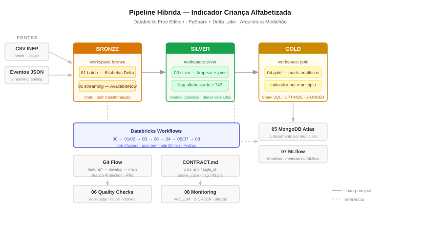
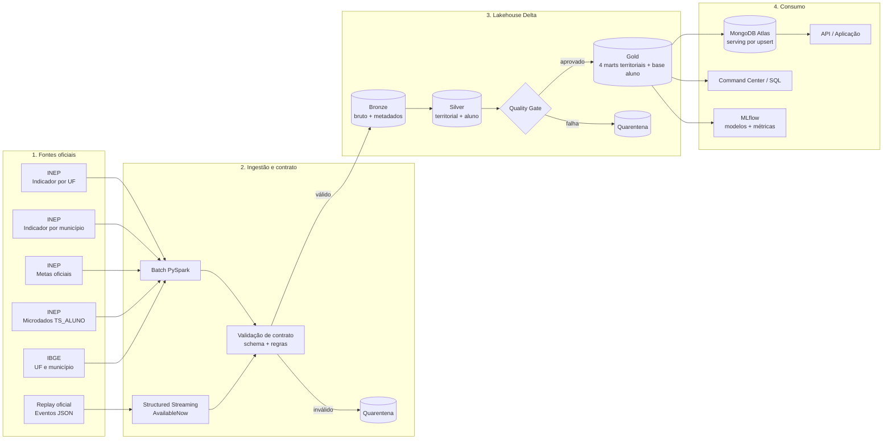

# Pipeline Híbrido de Alfabetização Infantil

Pipeline Lakehouse para integrar dados oficiais de alfabetização em **batch e streaming**, aplicar regras de qualidade, construir indicadores por município e UF e disponibilizar resultados para análise, serving NoSQL, observabilidade e experimentos de Machine Learning.

> Tech Challenge - Fase 2 · FIAP Pós Tech
> Plataforma principal: Databricks Free Edition · PySpark · Delta Lake · Unity Catalog

<p align="center">
  
</p>

## Contexto do problema

A alfabetização até o final do 2º ano do ensino fundamental é um dos pilares do desenvolvimento educacional e social do país. O **Compromisso Nacional Criança Alfabetizada** mobiliza União, estados e municípios para ampliar a alfabetização das crianças brasileiras.

A Pesquisa Alfabetiza Brasil definiu o **ponto de corte de 743 pontos** na escala de proficiência utilizada no projeto: no grão de aluno, registros com proficiência igual ou superior a 743 são classificados como alfabetizados.

Na fonte agregada, a `taxa_alfabetizacao` já representa o indicador percentual publicado pela fonte oficial. Por isso, o corte de 743 é aplicado aos **microdados de alunos** e não usado para reinterpretar a taxa agregada.

O problema tratado pelo projeto é a fragmentação dos dados que explicam o cenário de alfabetização: indicadores por UF e município, metas, dimensões territoriais e microdados de alunos possuem granularidades diferentes. O pipeline cria uma fundação única e governada para comparar resultado com meta, analisar desigualdades territoriais, acompanhar qualidade do dado e servir análises e modelos exploratórios.

## Fontes oficiais utilizadas

O pipeline atual não depende de dados sintéticos para construir seus indicadores analíticos.

| Entidade | Origem | Grão | Uso |
|---|---|---|---|
| Indicador de alfabetização por UF | INEP, com série agregada utilizada no projeto | Ano + UF + série + rede | Histórico e visão estadual |
| Indicador de alfabetização por município | INEP oficial | Ano + município + rede | Indicador e ranking municipal |
| Metas Brasil | INEP oficial | Ano | Referência nacional |
| Metas UF | INEP oficial | Ano + UF | Comparação resultado x meta |
| Metas município | INEP oficial | Ano + município | Priorização municipal |
| Microdados `TS_ALUNO.csv` | Avaliação da Alfabetização (Saeb) 2023 - INEP, 2º ano do Ensino Fundamental | Aluno | Regra dos 743 pontos e enriquecimento por UF |
| Estados e municípios | IBGE | UF / município | Enriquecimento territorial |

As planilhas oficiais e o microdado de alunos são preparados por um script
próprio, `scripts/gerar_fontes.py`, chamado pelo `00_setup_ambiente.py`
(não embutido nele — ver seção "Como executar" para o porquê). O script
preserva a proveniência das fontes e gera `fontes_oficiais_manifest.json`
com informações de rastreabilidade e hash.

Os antigos dados sintéticos foram retirados do fluxo oficial e mantidos apenas em `data/legacy_fontes_derivadas/` para rastreabilidade histórica.

> **Atenção — duas particularidades do `TS_ALUNO.csv` oficial:**
> 1. **Ano**: a edição mais recente publicada pelo INEP para o 2º ano do
>    Ensino Fundamental é a de **2023** (Saeb), não 2024. O restante do
>    pipeline (metas, indicador municipal) usa 2024, porque são fontes com
>    calendários de divulgação diferentes do microdado individual — o Saeb
>    2024 ainda não tinha sido publicado até a data desta entrega.
> 2. **Município anonimizado**: o campo de município do microdado de aluno
>    não corresponde ao código real do IBGE (é mascarado, provavelmente por
>    proteção LGPD nos dados individuais mais recentes do INEP). Por isso, o
>    pipeline usa apenas a **UF** do aluno como geografia confiável nesse
>    grão — não tente cruzar `id_municipio` de `silver.alunos_modelagem` com
>    a dimensão `bronze.municipio`, o join não é válido.

## Volumes reais das fontes e da execução

As fontes abaixo estão versionadas neste repositório. A contagem considera os
registros dos arquivos em `data/raw` e `data/external`, sem a linha de cabeçalho:

| Fonte versionada | Registros |
|---|---:|
| Indicador oficial por município | **10.584** |
| Indicador agregado por UF | **21** |
| Dimensão de municípios IBGE | **5.571** |
| Dimensão de UFs IBGE | **27** |
| Metas municipais oficiais | **37.344** |
| Metas por UF | **180** |
| Metas Brasil | **7** |
| Microdados `TS_ALUNO.csv` | **37.104** |

As tabelas Silver e Gold são criadas durante a execução e não ficam
armazenadas no Git. O `TS_ALUNO.csv` está versionado no repositório e é
publicado automaticamente no Volume pelo `00_setup_ambiente.py`; ainda
assim, a quantidade de alunos e das tabelas derivadas deve ser lida no
resultado do próprio run, nunca assumida como uma constante neste README —
o Quality Gate pode aprovar uma fração diferente a cada execução. A contagem
acima é apenas o total atual de registros do arquivo bruto versionado, sem
representar o volume final das tabelas Silver ou Gold.

Para obter as contagens atuais no Databricks, execute:

```python
TABELAS = [
      "bronze.alunos",
      "silver.medicoes_alfabetizacao",
      "silver.medicoes_aprovadas",
      "silver.alunos_modelagem_aprovados",
      "gold.indicador_municipio",
      "gold.resumo_uf",
      "gold.meta_vs_resultado",
      "gold.evolucao_temporal",
      "gold.base_modelagem_aluno",
]

for tabela in TABELAS:
      nome = f"workspace.{tabela}"
      if spark.catalog.tableExists(nome):
            print(f"{nome}: {spark.table(nome).count():,} registros")
      else:
            print(f"{nome}: ainda não criada")
```

> Cada evidência deve registrar a data e o `run_id`, pois novas fontes podem
> alterar as contagens.

## O que este projeto entrega

O projeto cobre o ciclo completo de um produto de dados:

- ingestão batch de fontes oficiais;
- replay controlado de registros oficiais em JSON para demonstrar o caminho de streaming;
- Structured Streaming com `AvailableNow`, checkpoint e deduplicação por `event_id`;
- contrato de dados e validação de schema;
- quarentena para payloads inválidos;
- arquitetura Medalhão com Delta Lake;
- modelo canônico Silver integrando diferentes granularidades;
- Quality Gate bloqueante antes da Gold;
- cinco marts Gold, incluindo a base oficial no grão de aluno para preparação da Fase 3;
- serving em MongoDB por `upsert`;
- experimentos e métricas registrados no MLflow;
- observabilidade técnica e de dados;
- Command Center executivo construído a partir da Gold;
- orquestração por Databricks Workflows;
- práticas de Git, documentação, segurança e FinOps.

## Arquitetura atual

A imagem em `docs/architecture.png` representa a visão executiva do pipeline. A arquitetura lógica canônica da versão atual é:


```mermaid
flowchart LR
    subgraph S[1. Fontes oficiais]
        UF[INEP\nIndicador por UF]
        MUN[INEP\nIndicador por município]
        META[INEP\nMetas oficiais]
        ALUNO[INEP\nMicrodados TS_ALUNO]
        IBGE[IBGE\nUF e município]
        EVT[Replay oficial\nEventos JSON]
    end

    subgraph I[2. Ingestão e contrato]
        BATCH[Batch PySpark]
        STREAM[Structured Streaming\nAvailableNow]
        CONTRACT[Validação de contrato\nschema + regras]
        Q1[(Quarentena)]
    end

    subgraph L[3. Lakehouse Delta]
        BR[(Bronze\nbruto + metadados)]
        SI[(Silver\nterritorial + aluno)]
        DQ{Quality Gate}
        GO[(Gold\n4 marts territoriais + base aluno)]
        Q2[(Quarentena)]
    end

    subgraph O[4. Consumo]
        MO[(MongoDB Atlas\nserving por upsert)]
        BI[Command Center / SQL]
        ML[MLflow\nmodelos + métricas]
        API[API / Aplicação]
    end

    UF --> BATCH
    MUN --> BATCH
    META --> BATCH
    ALUNO --> BATCH
    IBGE --> BATCH
    EVT --> STREAM

    BATCH --> CONTRACT
    STREAM --> CONTRACT

    CONTRACT -->|válido| BR
    CONTRACT -->|inválido| Q1

    BR --> SI --> DQ
    DQ -->|aprovado| GO
    DQ -->|falha| Q2

    GO --> MO
    GO --> BI
    GO --> ML
    MO --> API
```

### Camadas transversais

- **Databricks Workflows:** orquestração do DAG e propagação do `run_id`;
- **Observabilidade:** métricas, latência, rejeição, frescor e alertas;
- **Governança:** contrato, Unity Catalog, comentários de tabela e rastreabilidade;
- **Git + Git Flow:** branches, PR review e controle de versão;
- **FinOps:** uso sob demanda, `AvailableNow` e ausência de otimização prematura.

> GitHub Actions não é tratado como componente implementado na versão atual. CI permanece como evolução de roadmap.

## Decisões arquiteturais

| Decisão | Motivo |
|---|---|
| Batch e streaming convergem na Silver | Evita duas verdades de negócio e mantém um modelo canônico. |
| Streaming usa replay controlado de dado oficial | Permite demonstrar contrato, checkpoint, atraso, deduplicação e quarentena sem inventar o indicador de negócio. |
| Bronze preserva dados e metadados técnicos | Facilita auditoria, reconciliação e reprocessamento. |
| Metas são oficiais | Resultado não é comparado com alvo inventado ou interpolado. |
| Microdados de alunos são oficiais | A regra dos 743 pontos é demonstrada sobre registros reais da fonte utilizada. |
| Base de modelagem passa pelo Quality Gate | O grão de aluno é preservado em Silver, validado e só então publicado na Gold. |
| Quality Gate antecede a Gold | Uma task de qualidade reprovada impede a execução da Gold no Workflow. |
| `record_id` e `event_id` são determinísticos | Reduz duplicidade e melhora idempotência. |
| Delta Lake é a verdade analítica | Silver e Gold permanecem como fonte governada do produto de dados. |
| MongoDB é somente serving | Desacopla aplicações do Lakehouse sem substituir a fonte analítica de verdade. |
| MongoDB usa `upsert` | Evita apagar e recriar toda a coleção em cada execução. |
| Métricas operacionais são persistidas em Delta | Permite acompanhar saúde e comportamento do pipeline ao longo do tempo. |

## Tecnologias utilizadas e justificativa

| Ferramenta | Papel | Justificativa |
|---|---|---|
| Databricks Free Edition | Plataforma principal | Ambiente serverless para processamento, catálogo, SQL, Workflows e MLflow sem manter cluster ocioso na execução acadêmica. |
| PySpark | Transformação | Mesmo motor atende batch, agregações e Structured Streaming. |
| Delta Lake | Lakehouse | ACID, schema enforcement, `MERGE`, histórico e integração nativa com Spark. |
| Unity Catalog | Governança | Catálogo, schemas, tabelas e Volumes centralizados. |
| Structured Streaming | Caminho de eventos | Checkpoint, `AvailableNow`, `foreachBatch` e integração com Delta. |
| Databricks Workflows | Orquestração | DAG explícito, dependências e propagação do `run_id`. |
| MongoDB Atlas | Serving NoSQL | Camada opcional de consumo para aplicações, com `upsert` por chave de negócio. |
| MLflow | Experimentação | Registro de parâmetros, métricas, artefatos e model card. |
| GitHub | Versionamento | Git Flow, branches, PRs e revisão cruzada. |

## Fluxo de execução

| Ordem | Etapa | Entrada | Saída |
|---:|---|---|---|
| 00 | Setup | Configuração | schemas, volumes e observabilidade |
| 01 | Bronze batch | fontes oficiais | tabelas Bronze + metadados |
| 02 | Bronze streaming | replay oficial em JSON | `bronze.eventos_streaming` + checkpoint + quarentena |
| 03 | Silver | Bronze batch + streaming + dimensões + metas + microdados | modelo canônico territorial + `silver.alunos_modelagem` |
| 06 | Quality Gate | Silver | `medicoes_aprovadas` + `alunos_modelagem_aprovados` + métricas + quarentena |
| 04 | Gold | Silver aprovada | cinco marts, incluindo `gold.base_modelagem_aluno` |
| 05 | Serving | Gold municipal | MongoDB por `upsert` |
| 07 | MLflow | Gold municipal | baseline, Random Forest, métricas e model card |
| 08 | Monitoramento | métricas e tabelas Delta | saúde operacional |
| 09 | Dashboard | Gold + Observability | Command Center executivo |

A ordem **03 → 06 → 04** é proposital: a Gold só é executada pelo Workflow quando a task do Quality Gate termina com sucesso.

## Camadas de dados

### Bronze

A Bronze preserva a fonte recebida e adiciona somente metadados técnicos necessários para auditoria.

No batch, os campos técnicos incluem, conforme a fonte:

- `ingestion_timestamp`;
- `source_file`;
- `source_system`;
- `pipeline_run_id`;
- `schema_version`.

No streaming, os eventos mantêm os campos do contrato e recebem metadados técnicos do processamento.

A Bronze não calcula metas e não cria dados de negócio sintéticos.

### Silver

A Silver representa o modelo canônico do projeto.

Principais responsabilidades:

- normalização de `sigla_uf`, `id_municipio` e `rede`;
- normalização de percentuais para fração entre `0` e `1`;
- integração do indicador oficial por UF;
- integração do indicador oficial por município;
- integração do replay de streaming;
- enriquecimento territorial com UF, município e região;
- associação da meta correspondente ao **mesmo grão territorial**;
- ausência de fallback de meta municipal para meta de UF;
- agregação dos microdados oficiais de alunos por ano + UF + rede para enriquecer a visão territorial;
- preservação paralela do grão individual em `silver.alunos_modelagem`, com a
      quantidade de alunos disponível no `TS_ALUNO.csv` oficial;
- aplicação do corte de 743 sobre a proficiência individual somente para QA e agregações controladas;
- criação de `record_id` determinístico;
- identificação de origem em `fonte_dados`.

### Quality Gate

O Quality Gate avalia regras por registro e verificações sistêmicas.

Entre os controles:

- campos críticos obrigatórios;
- `id_municipio` com sete dígitos quando o grão é municipal;
- UF pertencente ao domínio brasileiro;
- rede pertencente ao domínio aceito;
- taxa dentro do intervalo esperado;
- integridade referencial;
- unicidade de `record_id`;
- Silver não vazia;
- cobertura mínima definida pelo projeto;
- Quality Gate específico da base de alunos, com validação de target, chaves territoriais, `record_id` e origem oficial.

Registros inválidos são enviados para:

```text
workspace.observability.quarantine_records
```

Falha sistêmica reprova a task. Como a Gold depende da task `quality`, uma execução reprovada não libera nova publicação Gold pelo Workflow.

Execuções validadas:

```text
Silver territorial aprovada: contagem informada pelo Quality Gate | cobertura calculada no run
Silver de alunos aprovada:   contagem informada pelo Quality Gate | rejeições calculadas no run
```

### Gold

A Gold é construída exclusivamente a partir da Silver aprovada.

| Tabela | Grão | Uso |
|---|---|---|
| `gold.indicador_municipio` | ano + município + rede | indicador e ranking territorial |
| `gold.resumo_uf` | ano + UF + rede | visão executiva por UF |
| `gold.meta_vs_resultado` | ano + território + rede | resultado observado x meta oficial |
| `gold.evolucao_temporal` | ano + território + rede | evolução e tendência |
| `gold.base_modelagem_aluno` | aluno | base oficial para classificação supervisionada na Fase 3 |

Os marts que combinam UF e município carregam o campo de nível territorial, evitando interpretar os dois grãos como se fossem equivalentes.

A `gold.base_modelagem_aluno` consome exclusivamente
`silver.alunos_modelagem_aprovados`. No run validado em 09/09/2026, a base
teve **37.104** registros; a contagem deve continuar sendo lida no resultado
do run do Databricks quando as fontes forem atualizadas.

O target preparado é `alfabetizado_oficial`. `proficiencia_portugues` e a flag derivada do corte de 743 não são publicadas como features nessa Gold de modelagem, evitando **data leakage**.

## Regra dos 743 pontos

O corte de 743 é aplicado no **grão de aluno**:

```text
alfabetizado = proficiencia >= 743
```

O pipeline utiliza os microdados oficiais `TS_ALUNO.csv` para demonstrar a regra.

Na fonte agregada, a `taxa_alfabetizacao` já representa o indicador percentual publicado. Portanto:

- não se aplica o corte de 743 sobre a taxa agregada;
- a regra por aluno é usada para produzir agregações auxiliares;
- o indicador oficial continua sendo preservado como medida principal.

## Contrato do streaming

O caminho de streaming utiliza **replay controlado de registros oficiais** em JSON para demonstrar propriedades técnicas do pipeline.

Exemplo estrutural:

```json
{
  "event_id": "uuid-deterministico",
  "event_time": "2026-08-31T20:00:00Z",
  "schema_version": "1.0",
  "ano": 2024,
  "sigla_uf": "AL",
  "id_municipio": "2700102",
  "rede": 3,
  "taxa_alfabetizacao": 0.70,
  "source": "INEP_OFICIAL_REPLAY"
}
```

A demonstração inclui propositalmente um payload inválido para comprovar a operação da quarentena. Esse evento de teste não representa indicador analítico.

Controles implementados:

- schema explícito;
- checkpoint isolado da landing zone;
- deduplicação por `event_id`;
- `MERGE` idempotente no destino;
- `AvailableNow`;
- quarentena para violações de contrato.

## Observabilidade

A execução utiliza um `run_id` comum para permitir rastreabilidade ponta a ponta em:

```text
workspace.observability.pipeline_metrics
```

Principais indicadores acompanhados:

- status por task;
- linhas lidas, escritas e rejeitadas;
- duração;
- frescor da Gold;
- latência do streaming;
- distribuição de origem;
- taxa de rejeição;
- registros de quarentena.

O monitoramento possui thresholds para rejeição, atraso e frescor e gera uma visão consolidada de saúde operacional.

## Serving com MongoDB

O MongoDB não substitui a Gold.

A arquitetura adota:

```text
Delta Lake / Gold = fonte analítica de verdade
MongoDB           = camada de serving
```

Justificativa honesta: nesta entrega não existe uma aplicação externa
consumindo o MongoDB. A camada foi implementada para demonstrar competência
em serving NoSQL com `upsert` idempotente, um padrão real de arquitetura de
dados, e não porque o Delta + SQL serverless fosse insuficiente para os
volumes atuais, o próprio `09_dashboard.py` prova isso ao consumir a Gold
em Delta diretamente, sem qualquer camada intermediária.

O cenário em que o MongoDB deixaria de ser apenas demonstrativo e passaria a
se justificar tecnicamente é o de uma aplicação com requisitos que o Delta
Lake não atende bem: leitura de documento único com latência de poucos
milissegundos (ex.: consulta pública por município num app mobile ou
widget embarcado), sem depender de um cluster/warehouse ativo. Essa é
exatamente a superfície que a Fase 3 pode explorar, uma API de consulta
pública sobre os documentos já publicados no Atlas, decisão registrada como
possível evolução em vez de aplicação real hoje.

A publicação é feita a partir de `gold.indicador_municipio`.

Chave de `upsert`:

```text
ano + id_municipio + rede
```

A connection string fica em secret do Databricks e não é versionada.

O notebook de serving é tolerante à ausência do secret na Free Edition: nesse caso, a etapa é registrada como não executada sem expor credenciais.

## Aplicação em IA

O notebook `07_ml_mlflow.py` utiliza `gold.indicador_municipio` para uma prova de conceito de regressão.

Estrutura atual:

- baseline com `DummyRegressor`;
- modelo `RandomForestRegressor`;
- features estruturais como ano, UF e rede;
- `media_portugues` e métricas derivadas do próprio alvo são excluídas para evitar vazamento;
- parâmetros, métricas e artefatos são registrados no MLflow;
- model card registra limitações e riscos.

O modelo é **exploratório**. Mesmo com cobertura municipal oficial, o conjunto atual possui poucas variáveis explicativas e não deve ser utilizado para decisão educacional real sem enriquecimento socioeconômico, validação temporal, análise de viés e explicabilidade.

### Preparação para a Fase 3

A POC de regressão do notebook `07` continua sendo uma entrega exploratória da Fase 2. Para a Fase 3, a fundação no grão correto já está disponível:

```text
workspace.bronze.alunos
        ↓
workspace.silver.alunos_modelagem
        ↓
workspace.silver.alunos_modelagem_aprovados
        ↓
workspace.gold.base_modelagem_aluno
```

A Gold de modelagem possui a quantidade de alunos publicada pelo run do
Databricks, com `alfabetizado_oficial` como target binário preparado para a
futura classificação.

A proficiência não foi publicada como feature nessa base porque está diretamente relacionada ao critério de 743 pontos e poderia produzir vazamento de informação. Enriquecimentos socioeconômicos e educacionais adicionais entram como evolução da Fase 3, mantendo proveniência e grão compatíveis.

## Command Center executivo

O notebook `09_dashboard.py` transforma a camada Gold em uma visão executiva com
9 abas, nesta ordem:

1. Visão geral;
2. Ranking territorial;
3. Matriz de prioridade;
4. Municípios prioritários;
5. Desigualdade regional e por rede;
6. Jornada até 2030 (trajetória e metas);
7. Proficiência dos alunos (microdados e corte de 743 pontos);
8. Qualidade e proveniência (inventário de fontes, marts da Gold e saúde operacional do pipeline);
9. Painel de decisão.

O dashboard consome a Gold e as métricas de observabilidade, sem reconstruir a regra de negócio fora do Lakehouse.

## Workflow

O Workflow possui DAG explícito:

```text
setup
  ├── bronze_batch
  └── bronze_streaming
          ↓
        silver
          ↓
       quality
          ↓
         gold
       ↙      ↘
  serving     mlflow
       ↘      ↙
      monitoring
```

Configuração de agenda:

```text
06:00
America/Sao_Paulo
PAUSED
```

O estado `PAUSED` é **deliberado** durante a execução acadêmica para evitar consumo desnecessário na Free Edition. A agenda permanece documentada e pode ser ativada em um ambiente de execução contínua.

## Workflow e Git

Fluxo adotado:

```text
feature/<tema>
      ↓
pull request
      ↓
develop
      ↓
validação integrada
      ↓
main
      ↓
tag de entrega
```

Regras mínimas:

- nenhuma alteração direta em `main`;
- PR com descrição e evidência de teste;
- revisão cruzada;
- mudança de schema exige atualização do contrato e dicionário;
- credenciais nunca são versionadas;
- o pipeline deve ser validado antes da release.

GitHub Actions não faz parte da implementação concluída desta fase.

## FinOps e performance

A decisão de performance usa os volumes das fontes versionadas e as contagens
produzidas pelo notebook `08_monitoring.py`. Neste checkout, as fontes locais
possuem **37.344 metas municipais**, **5.571 municípios** e **10.584 registros do
indicador municipal**. O `00_setup_ambiente.py` cria automaticamente todo o
catálogo (schemas, Volumes, tabelas de observabilidade), e publica no Volume
`workspace.bronze.raw_files` as fontes oficiais e o `TS_ALUNO.csv`, ambos já
versionados em `data/`. O setup não fabrica conteúdo de microdados: se o
`TS_ALUNO.csv` não estiver no repositório nem já publicado no Volume, o
`01_bronze_batch.py` pula a tabela `alunos` com um aviso, em vez de falhar.

Práticas adotadas:

- compute serverless e execução sob demanda;
- Workflow agendado, porém pausado no ambiente acadêmico;
- Structured Streaming com `AvailableNow`, evitando infraestrutura 24x7;
- ausência de `OPTIMIZE` e `ZORDER` prematuros;
- evitar `toPandas()` em grandes coleções;
- `toPandas()` limitado ao dataset municipal usado na POC de ML;
- schemas explícitos;
- métricas de duração e volume persistidas para permitir estimativa de custo.

### Particionamento: decisão explícita por tabela

Nem toda tabela da Gold tem o mesmo volume, então a decisão de particionar foi
avaliada tabela a tabela, não por uma regra genérica de "tabela pequena não
particiona":

| Tabela | Linhas | Particionada? | Motivo |
|---|---:|---|---|
| `gold.resumo_uf` | **145** | Não | Volume pequeno no padrão atual. |
| `gold.indicador_municipio` | **10.584** | Não | O mart é pequeno no padrão atual. |
| `gold.meta_vs_resultado` | **10.729** | Não | Mart misto pequeno no padrão atual. |
| `gold.evolucao_temporal` | **10.729** | Não | Mart misto pequeno no padrão atual. |
| `bronze.alunos` | **37.104** neste run | Não, por decisão consciente | A Silver lê a tabela inteira a cada execução, sem filtro por `ano` ou `sigla_uf`. Particionar sem leitura seletiva real não reduz custo e adiciona overhead de metadados no Delta. O volume pode variar conforme a fonte. |
| `gold.base_modelagem_aluno` | **37.104** neste run | Não, por decisão consciente | É consumida inteira pelo notebook de ML (`07_ml_mlflow.py`), sem filtro incremental. Particionar sem leitura seletiva real não reduz custo e adiciona overhead de metadados no Delta. O volume pode variar conforme a fonte. |

Quando isso deveria ser revisto: se a Fase 3 passar a consultar
`gold.base_modelagem_aluno` de forma seletiva (ex.: treinar só com um ano, ou
uma API filtrando por UF), particionar por `ano` ou `sigla_uf` passa a
compensar. Hoje, para carga completa, o particionamento é dispensável, não
por o volume ser pequeno, mas porque o padrão de acesso não seleciona um
subconjunto dos dados.

> As contagens acima representam a última execução validada. Uma nova execução
> pode alterá-las quando novas fontes oficiais ou novos microdados forem
> incorporados.

### Custo acadêmico

No ambiente utilizado para a entrega:

```text
Databricks Free Edition
MongoDB Atlas Free Tier, quando configurado
GitHub
```

**Custo direto observado do projeto acadêmico: R$ 0.**

### Estimativa ilustrativa de cenário produtivo

Os valores abaixo são uma **estimativa de planejamento**, não uma cotação comercial nem custo medido do projeto:

| Item | Hipótese | Estimativa/mês |
|---|---|---:|
| Jobs serverless | carga diária curta | ~US$ 55 |
| Streaming `AvailableNow` | execuções periódicas | ~US$ 28 |
| Armazenamento de objetos | dezenas de GB com histórico | ~US$ 2 |
| MongoDB gerenciado | camada pequena de serving | ~US$ 57 |
| **Total ilustrativo** | | **~US$ 142/mês** |

A decisão arquitetural deve ser reavaliada com métricas reais de execução, frequência, retenção e crescimento dos microdados antes de qualquer implantação produtiva.

## Estrutura do repositório

```text
.
├── data/
│   ├── external/                 # dimensões territoriais IBGE
│   ├── source/                   # planilhas oficiais utilizadas na preparação
│   ├── raw/                      # fontes preparadas para ingestão
│   ├── legacy_fontes_derivadas/ # legado sintético fora do pipeline oficial
│   └── sample/
├── docs/
│   ├── architecture.png
│   ├── architecture.svg
│   ├── data_dictionary.md
│   ├── flow_review.md
│   ├── fontes_e_entidades.md
│   ├── runbook.md
│   ├── team_playbook.md
│   └── video_roteiro.md
├── notebooks/
│   ├── 00_setup_ambiente.py
│   ├── 01_bronze_batch.py
│   ├── 02_bronze_streaming.py
│   ├── 03_silver.py
│   ├── 04_gold.py
│   ├── 05_serving_mongodb.py
│   ├── 06_quality_checks.py
│   ├── 07_ml_mlflow.py
│   ├── 08_monitoring.py
│   └── 09_dashboard.py
├── src/
│   ├── schemas.py
│   └── utils.py
├── tests/
│   ├── test_utils.py
│   ├── test_silver_contract.py
│   └── test_quality_gate.py
├── workflows/
│   ├── 00_pipeline_runner.py
│   └── job_pipeline.json
├── CONTRACT.md
├── CONTRIBUTING.md
├── TASKS.md
└── requirements.txt
```

## Como executar

### Pré-requisitos

- **Conta/workspace Databricks própria** (a versão gratuita "Community
  Edition" serve, não precisa pagar nada). **Cada pessoa do grupo precisa
  da própria conta** — não dá pra usar o workspace de outra pessoa do
  grupo, isso consome os créditos dela;
- clonar este repositório do GitHub direto no workspace (Databricks Repos
  ou equivalente);
- MongoDB Atlas somente se a etapa de serving for demonstrada;
- secret `alfabetizacao/mongo_uri` somente para publicação real no MongoDB.

> **O que o `00_setup_ambiente.py` faz sozinho, sem precisar editar nada:**
> cria os 4 schemas do catálogo (`bronze`, `silver`, `gold`, `observability`),
> os 4 Volumes usados pelo pipeline, e as 2 tabelas de observabilidade —
> toda a estrutura do catálogo é criada do zero na primeira execução, em
> qualquer workspace. Depois disso, ele copia as fontes oficiais e o
> `TS_ALUNO.csv` (ambos já versionados neste repositório) para uma pasta
> temporária no disco local do cluster, roda `scripts/gerar_fontes.py` a
> partir de lá, e publica o resultado no Volume `bronze.raw_files`.
>
> **Por que não faz tudo direto no Workspace do Git?** Escrever arquivos
> dentro de `/Workspace/Repos` (onde o notebook fica quando clonado via
> Git) se mostrou não confiável nesse ambiente — os arquivos gerados não
> persistiam. Por isso o setup usa uma pasta local (`/tmp/...`) como área
> de trabalho e só escreve no destino final (o Volume, que é compartilhado
> por todo o catálogo) no fim do processo.
>
> **Sobre o `TS_ALUNO.csv`**: como já está versionado em
> `data/raw/microdados_inep/DADOS/TS_ALUNO.csv` neste repositório, ele é
> publicado automaticamente pelo `00_setup_ambiente.py` — **não precisa
> mais de upload manual por pessoa**. Se um dia esse arquivo for atualizado
> (ex.: quando o Saeb 2024 for publicado), é só substituir o arquivo no
> repositório e rodar o setup de novo.

### Ordem

1. Execute `00_setup_ambiente.py`. Ele cria toda a estrutura do catálogo
   (schemas, Volumes, tabelas de observabilidade) e já prepara e publica
   todas as fontes oficiais no Volume, incluindo o `TS_ALUNO.csv`.
2. Execute `01_bronze_batch.py`. A tabela `bronze.alunos` deve ser criada
      com registros; se `TS_ALUNO.csv` estiver ausente ou vazio, a execução
      falha explicitamente para evitar uma Bronze incompleta.
3. Execute `02_bronze_streaming.py`.
4. Execute `03_silver.py`.
5. Execute `06_quality_checks.py`.
6. Somente após aprovação, execute `04_gold.py`.
7. Execute `05_serving_mongodb.py` se houver secret configurado.
8. Execute `07_ml_mlflow.py`.
9. Execute `08_monitoring.py`.
10. Execute `09_dashboard.py`.

Cada notebook tem, na primeira célula, uma explicação em markdown do que
ele faz e o que precisa ter rodado antes dele — leia antes de executar se
tiver dúvida.

A mesma ordem está representada no Databricks Workflow
(`workflows/job_pipeline.json`). A execução funcional dos notebooks deve ser
feita pelo Workflow ou diretamente no workspace Databricks.

## Testes

### Resultado da execução Databricks

Em 09/09/2026, a sequência `01 → 02 → 03 → 06 → 04` foi executada com
sucesso no Databricks. O Quality Gate foi aprovado e a Gold foi publicada com
cinco marts, grão documentado, nível territorial explícito nos marts mistos e
origem oficial do INEP identificada.

Volumes confirmados nesse run:

| Tabela | Linhas |
|---|---:|
| `bronze.alunos` | **37.104** |
| `gold.indicador_municipio` | **10.584** |
| `gold.resumo_uf` | **145** |
| `gold.meta_vs_resultado` | **10.729** |
| `gold.evolucao_temporal` | **10.729** |
| `gold.base_modelagem_aluno` | **37.104** |

O `compileall` local dos notebooks também foi validado sem erros. Os volumes
acima são evidências do run Databricks e podem variar quando as fontes forem
atualizadas.

A suíte de testes cobre:

- regra de alfabetização dos 743 pontos;
- ausência de fallback sintético;
- contrato e schema das fontes oficiais;
- consistência do modelo Silver;
- unicidade e determinismo de `record_id`;
- associação de metas no mesmo grão territorial;
- regras do Quality Gate territorial e do Quality Gate da base de alunos.

Execução:

```python
import pytest

resultado = pytest.main(["-q", "tests"])
assert resultado == 0
```

## Demonstração sugerida

Para uma apresentação executiva curta:

1. mostrar a arquitetura;
2. apresentar as fontes oficiais e o volume real;
3. mostrar Bronze batch e replay de streaming;
4. mostrar um payload inválido chegando à quarentena;
5. apresentar a Silver canônica;
6. executar o Quality Gate;
7. mostrar os cinco marts Gold, destacando `base_modelagem_aluno`;
8. abrir o Command Center;
9. mostrar rapidamente MLflow e observabilidade.

A demonstração deve caber em **até 5 minutos**, priorizando arquitetura, confiabilidade, dados oficiais e valor analítico.

## Limitações conhecidas

- o streaming é um **replay por arquivos JSON com `AvailableNow`**, não Kafka ou Event Hubs em execução contínua;
- o evento inválido existe apenas para demonstração controlada da quarentena;
- o dataset municipal e as metas são oficiais, mas a cobertura temporal depende da publicação disponível na fonte;
- o de-para da rede deve permanecer rastreável à documentação da fonte;
- o MongoDB é opcional e não participa da verdade analítica;
- a POC de ML da Fase 2 possui poucas features e não deve orientar decisões educacionais reais;
- a Gold de aluno está preparada para a Fase 3, mas ainda precisa de enriquecimentos e pipeline de classificação antes de uso preditivo;
- o enriquecimento socioeconômico permanece como evolução futura;
- o Databricks Free Edition possui limitações de infraestrutura e integração;
- CI automatizada ainda não faz parte da entrega concluída.

## Roadmap

- [ ] implementar replay operacional da quarentena;
- [ ] adicionar CI para validação de Python, JSON e Markdown;
- [ ] enriquecer com dados socioeconômicos;
- [ ] ampliar testes de não regressão dos indicadores;
- [ ] avaliar API de consulta sobre a camada de serving;
- [ ] reavaliar particionamento e otimizações quando volume e frequência justificarem;
- [ ] publicar release final com evidências reproduzíveis.

## Documentação complementar

- [Contrato técnico e de negócio](CONTRACT.md)
- [Backlog e responsáveis](TASKS.md)
- [Revisão do fluxo](docs/flow_review.md)
- [Playbook do time](docs/team_playbook.md)
- [Runbook de execução e demonstração](docs/runbook.md)
- [Dicionário de dados](docs/data_dictionary.md)
- [Fontes e entidades](docs/fontes_e_entidades.md)
- [Roteiro do vídeo executivo](docs/video_roteiro.md)
- [Índice das evidências](docs/evidencias/README.md)
